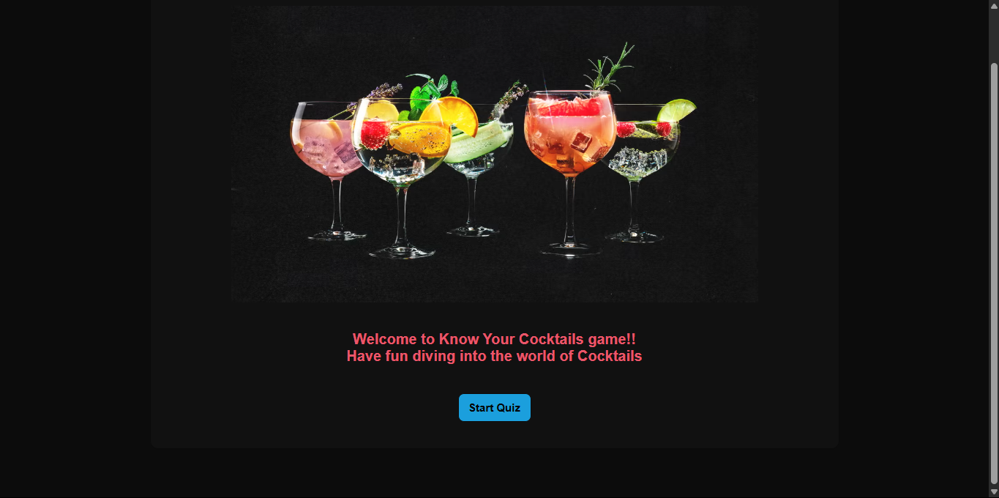
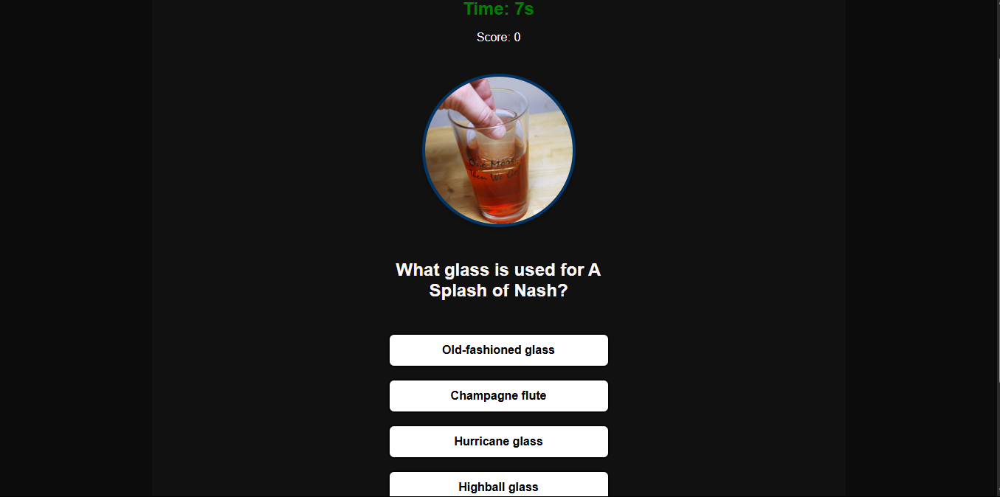
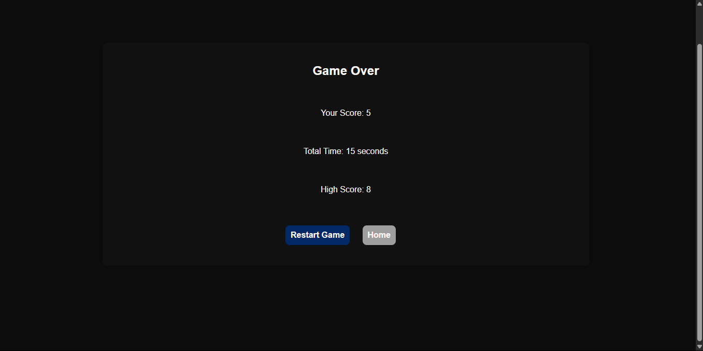

# Jimmy-Okwiri-cocktail-quiz
# 🍸 Know Your Cocktails Drinks - Cocktail Quiz Game

Welcome to **Know Your Cocktails Drinks**, a fun and interactive Single Page Application (SPA) quiz game that tests your knowledge about cocktail drinks! 

Built using HTML,  CSS and JavaScript this game fetches real-time cocktail data from [TheCocktailDB API](https://www.thecocktaildb.com/api.php).

## Folder Structure

```bash
Jimmy-Okwiri-cocktail-quiz/

│
├── index.html
├── styles.css
├── index.js
├── assets/
│   └── sprite-cocktails.avif
└── README.md

```
## Technologies

- **Frontend**: HTML5, CSS3, Vanilla JavaScript (ES6+)
- **API**: [TheCocktailDB](https://www.thecocktaildb.com/)
- **Style**: Custom CSS with animations and transitions

---

## Setup
In order for you to setup and run this repository locally, do the following:

1. **Fork the repository then Clone it.**
``` shell
git clone git@github.com:Moringa-SDF-PT10/Jimmy-Okwiri-cocktail-quiz.git
 ``` 
 2. **In your terminal, navigate to the cloned project directory.**
 ``` shell
 cd Jimmy-Okwiri-cocktail-quiz/
 ```
 3. **Open the cloned repository in ``Visual Studio Code.``**
 ``` shell
code . 
 ```
 or 
 ``` shell
code Jimmy-Okwiri-cocktail-quiz/
 ```

 4. **Open index.html in your browser to view.**

In your terminal run the following command:
```
explorer.exe index.html
```
 To Access the hosted webpage click on :
 [Know Your Cocktails Drinks](https://moringa-sdf-pt10.github.io/Jimmy-Okwiri-cocktail-quiz/)

## 🎯 Features

-  **Start-to-finish quiz flow** with a splash screen, quiz rounds, and results
- 🧠 **Multiple question types**: Guess the ingredients, glass type, or name of the cocktail
- ⏱️ **Timer-based gameplay** with time pressure to keep you on your toes
- 💡 **Hint system** to eliminate wrong options (but at a score cost!)
-  **Final results screen** with score high score and Total time summary
-  Smooth UI with animations and transitions
---


## 🧩 How to Play

1. Clicks **Start Quiz** to start the game.
2. App fetches random cocktail data from the CocktailDB API
3. Generates 3 types of questions per cocktail:
   - Guess the **ingredient**
   - Guess the **glass type**
   - Guess the **cocktail name**
4. Player selects answers within a 15-second timer or the it will automatically move to the next question.
5. Player may use **hint** which removes 2 wrong answers after being used leaving 2 0r 3 answers to choose from.
6. Final score , high score and total time taken are displayed on completion


## 📸 Screenshots

|Start Screen| 
|--------------|
||

|Quiz Screen |
|-------------|
||


|Results Scre|
|---------|
| |
---

## 🚀 Live Demo

[🔗 Click here to play the game!](https://moringa-sdf-pt10.github.io/Jimmy-Okwiri-cocktail-quiz/)

---

## How to contribute for Future Improvements 
🎵 Add background music and sound effects

💬 Include fun cocktail facts after each question


## Acknowledgments
- Moringa School for this fun and interactive project and also for their support
- TheCocktailDB for their awesome free API

